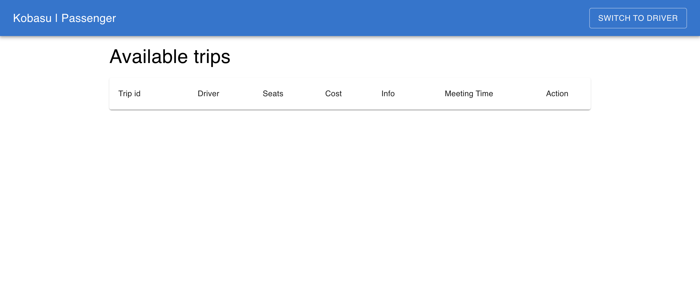

# Table of contents

### [Kobasu manual](#kobasu-manual-1)

- [Authentication](#authentication)
- #### [Driver](#driver-1)
  - [Make a ride offer](#make-a-ride-offer)
  - [Accept a ride bid](#accept-a-ride-bid)
  - [Start trip](#start-trip)
  - [Finish trip](#finish-trip)
- #### [Passenger](#passenger-1)
  - [Make a ride bid](#make-a-ride-bid)
  - [Finish trip](#finish-trip-1)

 

# Kobasu manual

## Authentication

1. If you did the project execution steps correctly present in the [README](README.md), you only need to click on any of the join buttons to enter the system, either for driver or passenger. Your account management will be done automatically with MetaMask

2. If you joined successfully as a driver, you will see this screen

3. If you joined successfully as a passenger, you will see this screen

## Driver

---

## Make a ride offer

1. As a driver, you can make ride offers, just input all information and click on the make offer button

2. You will be prompted to accept the transaction in MetaMask

3. If you confirmed the transaction, and it executed successfully, you will see the waitlist for the offered ride. In this screen you will be able to accept bids, start the trip and revoke the offer (you can only revoke the offer if it does not have any accepted bids).

## Accept a ride bid

1. As a driver, you can accept the bids that the passengers make

2. You will be prompted to accept the transaction in MetaMask

3. If you confirmed the transaction, and it executed successfully, you will see bid in accepted bids, and the passenger will see the change reflected in their page

## Start trip

1. As a driver, you can start the trip when you have at least one accepted bid

2. You will be prompted to accept the transaction in MetaMask

3. If you confirmed the transaction, and it executed successfully, you will see that the trip has started

## Finish trip

1. As a driver, you can finish a trip if it has been completed

2. You will be prompted to accept the transaction in MetaMask

3. If you confirmed the transaction, and it executed successfully, you will see the make offer page

## Passenger

---

## Make a ride bid

1. As a passenger, you can make ride bids, just select any of the offered rides

2. Input any amount that you consider proper for this ride, and click on the make bid button

3. You will be prompted to accept the transaction in MetaMask

4. If you confirmed the transaction, and it executed successfully, you will see the ride status report. It is important to mention that if the driver accepts your bid, here you will see the change reflected, also you will be able to see if the trip has already started

## Finish trip

1. As a passenger, you can finish a trip if it has been completed.

2. You will be prompted to accept the transaction in MetaMask

3. If you confirmed the transaction, and it executed successfully, you will see the make bids page

