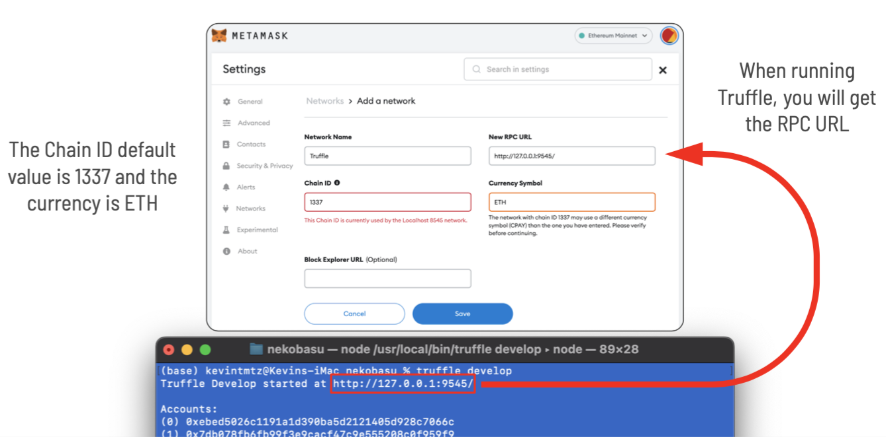
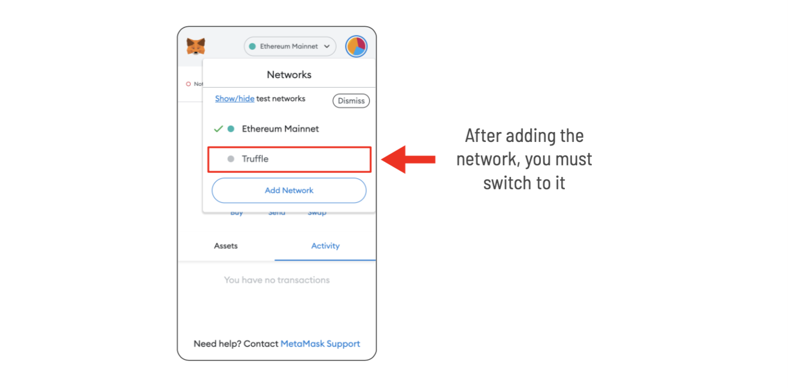
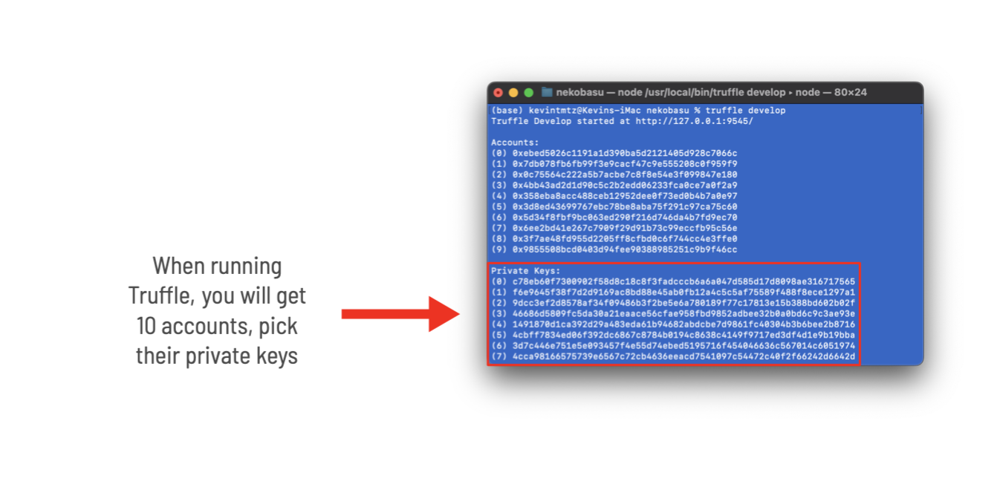
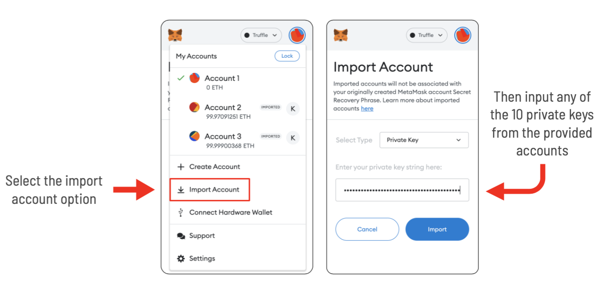
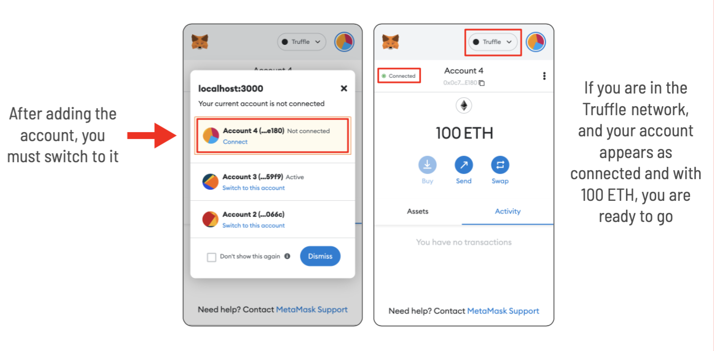

# (ne) Kobasu

A web3 ridesharing service.

- A driver pubilshes a slot of time when they are available to provide ridesharing. Defining: period, seats and cost
- The passengers send their bids
- The passengers are notified wether their bids were accepted or not
- The driver starts the trip and the passegers are notified
- When the trip is completed, the driver and the passengers finish the trip

<br>

> ## [Check the Kobasu manual!](./HOWTO.md)

> ## [Check the Nekobasu contract tests!](./CONTRACT-TEST.md)

<br>

# Table of contents

### [Project execution](#project-execution-1)

- [How To run](#how-to-run)
- [Ethereum environment](#ethereum-environment)
- [MetaMask configuration](#metamask-configuration)

<br>

# Project execution

## How To run

1. Download the source code from github

```bash
git clone https://github.com/tlacuilose/kobasu.git
```

2. Go to the project directory

```bash
cd kobasu
```

3. Install project dependencies

```bash
npm install
```

4. Execute the web application

```bash
npm start
```

<br>

## Ethereum environment

1. Install truffle, this is a tool for uploading Contracts and starting a eth local node.

```bash
npm install -g truffle
```

2. Go to nekobasu inside the project directory

```bash
cd kobasu/nekobasu
```

3. Start truffle development

```bash
truffle develop
```

4. Deploy contract in Truffle cli

```bash
migrate --reset
```

<br>

## MetaMask Configuration

1. Install MetaMask in your browser

> [MetaMask download page](https://metamask.io/download)

2. Add the Truffle network into MetaMask





3. Import accounts into MetaMask






